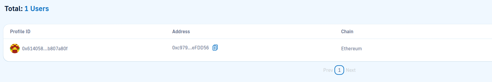

# Sample Django Authentication With Web3

## Required 
1. Python version: 3.10
2. Register account and get API key at https://moralis.io/

## Quick Starts

1. Go to `moralis_auth/web3_auth/views.py` and update `API_KEY`
2. Init virtual env `python3 -m venv .venv`
3. Load virtual env `source .venv/bin/activate`
4. Install required packages `pip install -r requirements.txt`
5. Run server `python manage.py runserver`

## Images

